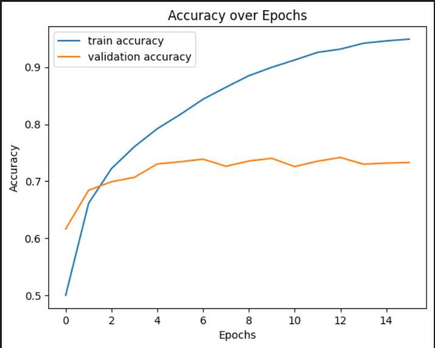
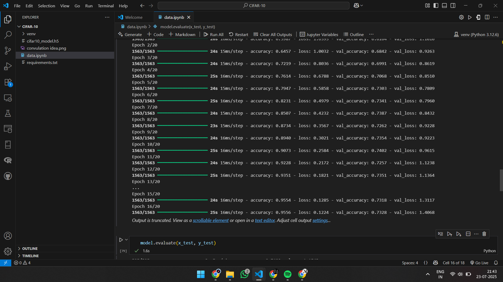

## 🧠 CIFAR-10 Image Classification using CNN, BatchNorm & Dropout

This project compares two CNN models trained on the CIFAR-10 dataset:

1. **Basic CNN**
2. **CNN with Batch Normalization + Dropout**

By visualizing training and test performance, we highlight the improvements in generalization and accuracy.

---

### 📚 Dataset

* **CIFAR-10** consists of 60,000 32x32 color images in 10 classes.
* 50,000 training and 10,000 test images.

---

### 🧪 Models

#### 1️⃣ Basic CNN

* Convolution + ReLU
* MaxPooling
* Dense Layers
* Softmax Output

#### 2️⃣ CNN with BatchNorm & Dropout

* BatchNorm layers added after convolutions
* Dropout (0.3–0.5) applied after dense layers
* Improved generalization

---

### 📊 Results

| Model                      | Test Accuracy |
| -------------------------- | ------------- |
| Basic CNN                  | \~73.2%       |
| CNN with BatchNorm/Dropout | \~76.3%       |

---

### 🖼️ Screenshots

#### 🔵 Accuracy Comparison Plot:



#### 🟢 Training Logs:



*You can clearly see the improved validation accuracy and reduced overfitting using BatchNorm and Dropout.*

---

### 🛠️ Tech Stack

* Python
* TensorFlow / Keras
* NumPy, Matplotlib

---

### 🚀 How to Run

```bash
git clone https://github.com/NithishKannanM/cifar_10.git
cd cifar10
pip install -r requirements.txt
python cifar10.py
```

---

### 💡 Learnings

* **Batch Normalization** speeds up training and stabilizes the learning process.
* **Dropout** prevents overfitting.
* These simple techniques significantly boost test performance.

---

### 📈 Future Work

* Add data augmentation
* Try deeper CNNs or ResNet
* Explore CIFAR-100

---

### 🤝 Connect

Let’s connect on [LinkedIn](www.linkedin.com/in/nithish-kannan-m)!
If you liked this project, leave a ⭐ on the repo 🙂

---

